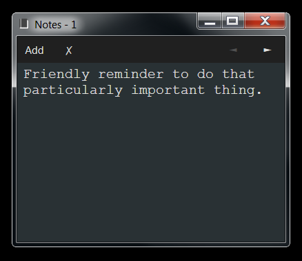

# Description

Basic notes application, you can add multiple notes and minimize the application to the system tray.

# Keyboard Shortcuts

-   `ctrl + n` : New note.
-   `ctrl + r` : Remove the current note (asks for confirmation).
-   `ctrl + q` : Show the previous note.
-   `ctrl + w` : Show the next note.
-   `ctrl + o` : Open the options window.
-   `ctrl + [1-9]` : Show the note in that position (for example, `ctrl + 1` shows the first note, `ctrl + 2` shows the second, etc).
-   `Escape` : Hide/close the current active window (the notes window is hidden only if the `minimize on close` option is set).

# Development

## Code format

-   `dotnet tool run dotnet-csharpier . --check`

## Build

After building the application, copy the following files to a folder (from `/bin/Release/`).

-   assets/\*
-   \*.dll
-   notes_app.exe
-   notes_app.exe.config
